# WebDev - Ayudantía 01

# Crear Instancia EC2

En caso que no hayan podido crear su instancia durante las clases de cátedra, lo explicaremos brevemente acá. Una instancia EC2 de Amazon es básicamente una máquina virtual, es decir, un computador virtual que está corriendo en un computador físico en los servidores de Amazon, en dónde podemos ejecutar aplicaciones, almacenar datos, entre otros.

1. Buscar EC2 en el navegador, y abrir “Panel”.

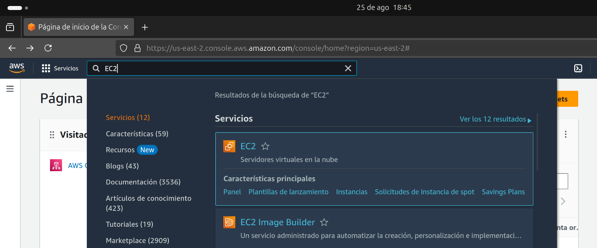

2. En el panel, apretar donde dice “Lanzar Instancia”.

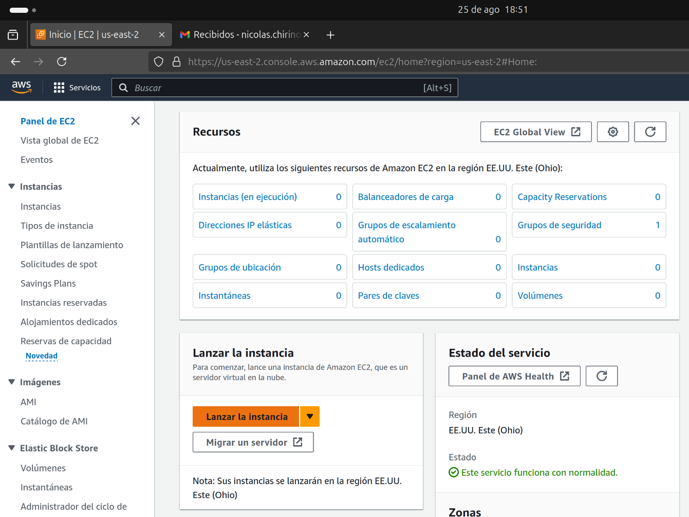

3. Poner el nombre que ustedes quieran a la instancia, y seleccionar una imagen de Ubuntu de 64 bits.


4. Seleccionar la instancia más pequeña que puedan, en este caso seleccioné “t2.micro”. Esto dado que una página web no necesita de muchos recursos.

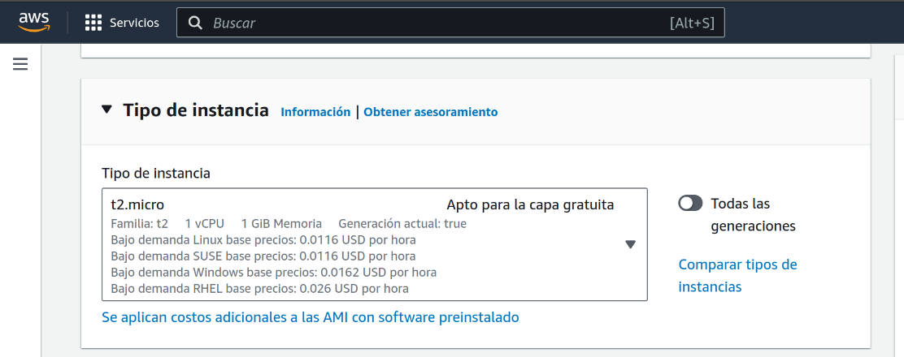

5. Generar un nuevo par de llaves, esto generará un archivo .PEM que deberemos guardar como hueso santo. Al apretar el botón les saldrá la siguiente interfaz, pueden poner el nombre que ustedes quieran.

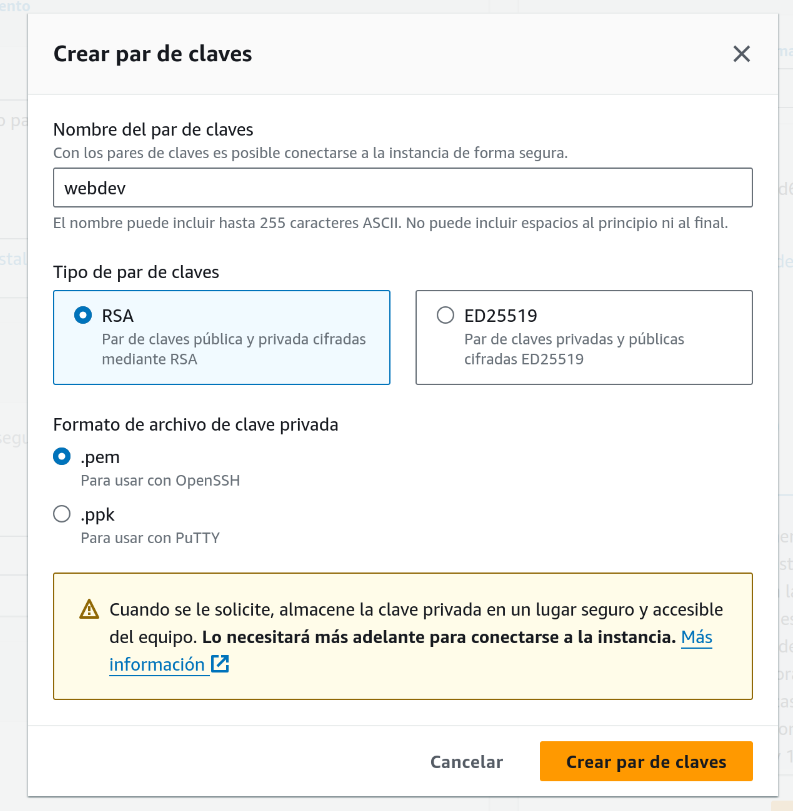

6. Guardamos el archivo .PEM en un lugar dónde no se nos vaya a olvidar.

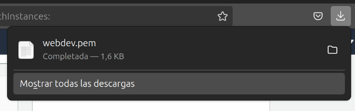

7. Luego, se seleccionará automáticamente el par de claves como “webdev”, que es el nombre que yo le puse al archivo .PEM.

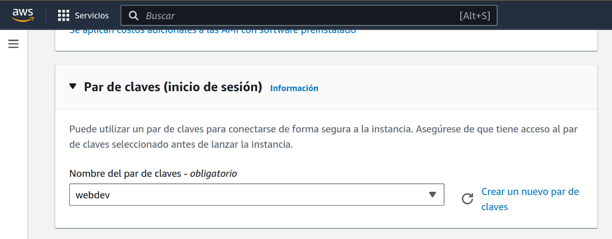

8. Modificamos la configuración de red, y seleccionamos para permitir el tráfico SSH, HTTPS y HTTP. 

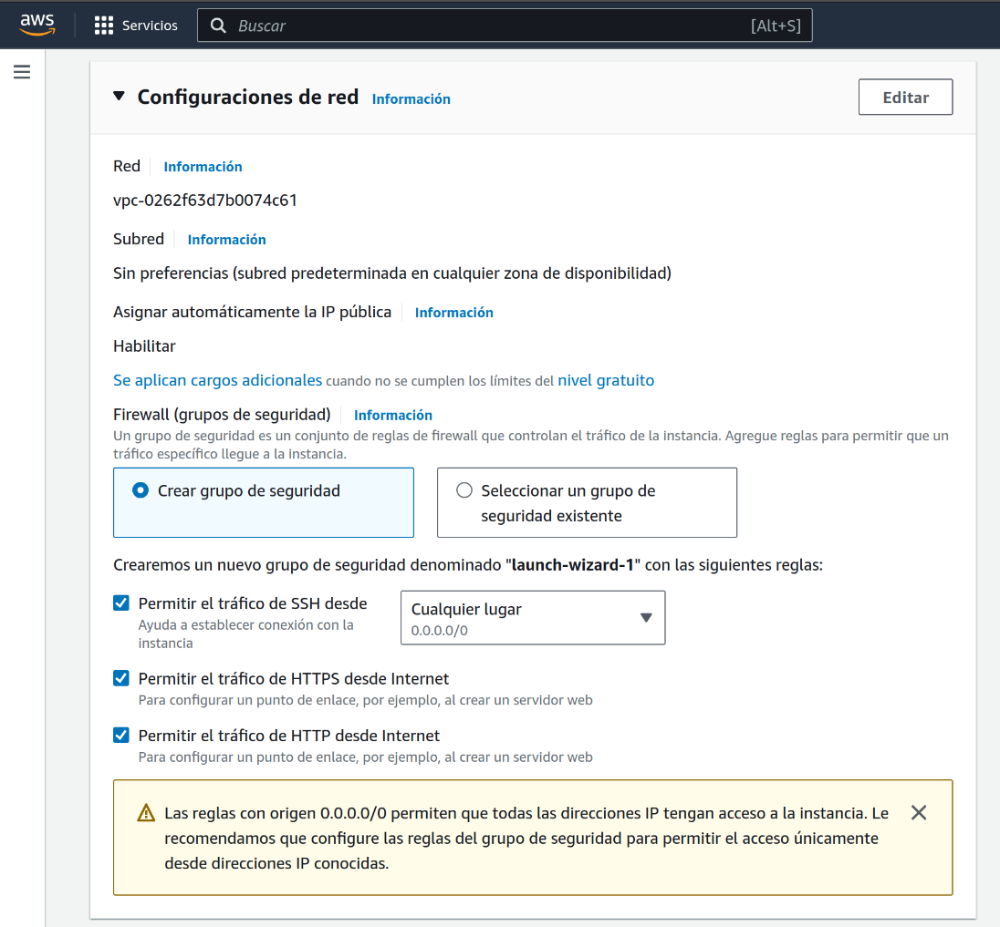

9. Una vez listo, creamos la instancia en el apartado derecho. Esto nos mostrará la siguiente página, donde apretaremos “Conectarse a una instancia”.

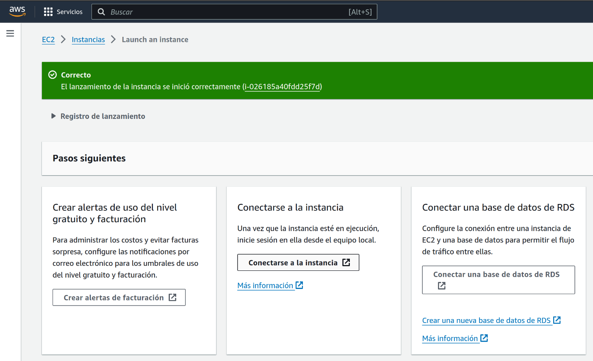

10. Para conectarnos a la instancia, apretaremos “Cliente SSH”, si tienen acceso a una terminal desde el computador. Acá debemos abrir una terminal dentro de la carpeta en dónde hayamos guardado el archivo .PEM, copiar el comando de ejemplo, y lo pegamos en la terminal. 

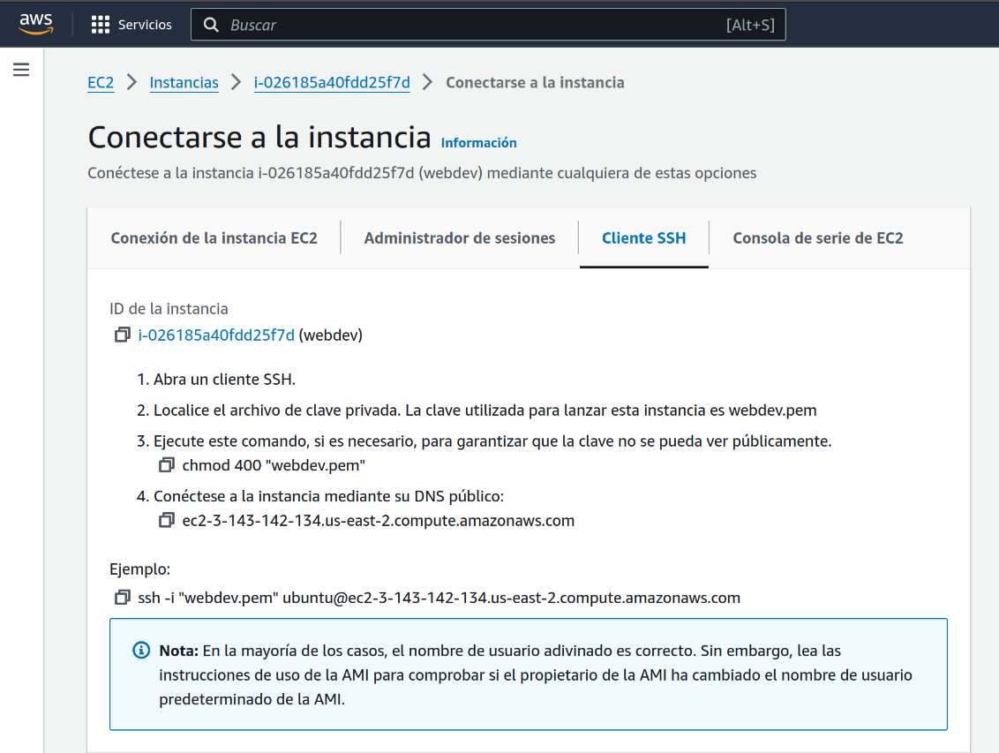

Y listo! ya estamos conectados a nuestra instancia EC2 mediante SSH. Acá podemos ejecutar comandos y configurar nuestra instancia para levantar el servidor.

# Levantar servidor web NGINX

Nuestra instancia ya está en la web, pero si accedemos desde nuestro navegador no nos mostrará nada. Para levantar un servidor web y mostrar páginas al mundo, lo haremos utilizando NGINX. 1. 

1. Para esto, ejecutaremos los siguientes comandos en la terminal.

```shell
sudo apt update
sudo apt install nginx -y
```

Esto actualiza los programas y paquetes de nuestra instancia, y luego instala el paquete “NGINX”, el cuál será nuestro servidor web.

2. Una vez instalado, tendremos que ejecutar este servicio, utilizando los comandos:

```shell
sudo systemctl start nginx
sudo systemctl enable nginx
```

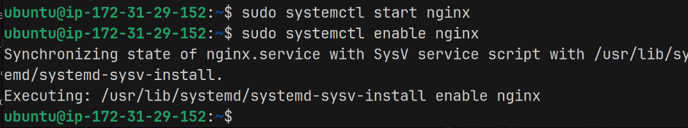

3. Por último, modificaremos los permisos de la carpeta en la cuál se alojarán nuestros archivos de la página web, de forma que sólo nosotros podamos modificarlos.

```shell
sudo chown -R $USER:$USER /var/www/
sudo chmod -R 755 /var/www
```

Una vez listo, estará listo nuestro servidor web, y podremos acceder a nuestra instancia desde el navegador. Para esto iremos al panel de la instancia en Amazon AWS, y apretaremos donde dice dirección abierta. **Esto no nos mostrará nada, porque debemos sacarle la “S” de HTTPS al link.** Si todo salió bien, les mostrará la siguiente página.

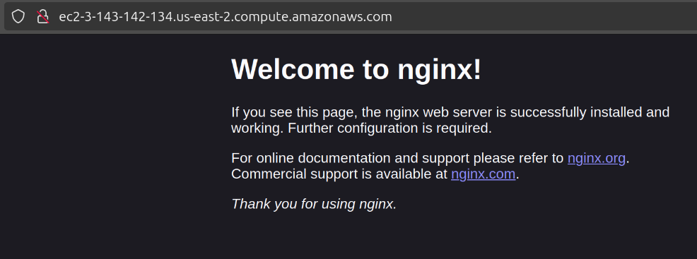

Ahora, sólo nos falta mostrar los archivos correspondientes a nuestra página.

# Subir archivos con FileZilla

FileZilla es un cliente SFTP para poder enviar archivos de forma segura y visual mediante SSH, utilizando una interfaz gráfica.

4. Primero nos conectaremos a la instancia, mediante el gestor de sitios.


5. Acá, seleccionaremos “Nuevo Sitio”, le pondremos el nombre que queramos y llenamos los campos de la derecha.
    1. Protocolo: SFTP
    2. Servidor: IPv4 pública de la instancia (Se obtiene desde el panel de AWS)
    3. Puerto: 22
    4. Modo de acceso: Archivo de claves
    5. Usuario: ubuntu
    6. Archivo de claves: Archivo .PEM
    
    Y le damos a Conectar y Aceptar.
    


6. No es necesario guardar una contraseña maestra. Si todo salió bien, nos aparecerá la siguiente interfaz:


7. Luego, buscamos el directorio en dónde se hospedan nuestros archivos del servidor web. Para esto, dentro de “Sitio remoto” buscamos “/var/www/html”, y moveremos nuestros archivos .html aquí, seleccionando los archivos y arrastrándolos.


8. Si todo salió bien, podemos refrescar la página correspondiente al servidor web desde el navegador, y aparecerá nuestro nuevo index.html


Si se dan cuenta, yo subí dos archivos a la instancia, “index.html” y “contacts.html”, pero si voy a la página “ipinstancia/contacts” no me aparece nada, entonces, ¿Cómo arreglo esto?


# Routing de archivos estáticos

El error anterior ocurrió ya que no pusimos .html al final de la ruta, es decir, debió ser /contacts.html. Pero esto se ve feo y además, no es lo que se hace en el día a día. Entonces, para poder hacer que nuestro servidor muestre la página HTML, sin poner directamente .HTML en la URL, tendremos que modificar un poco nuestro servidor web de NGINX.

1. Dentro de la terminal la cuál está conectada a nuestra instancia por SSH, ejecutaremos el siguiente comando:

```shell
sudo nano /etc/nginx/sites-available/default
```

2. Esto nos abrirá el archivo de configuración de NGINX, utilizando el editor de texto “nano”. Bajaremos hasta donde dice “location” y agregaremos lo siguiente:

```shell
location /contacts {
    try_files /contacts.html =404;
}
```

3. Debería quedar de la siguiente forma:


4. Finalmente, guardamos los cambios en el archivo utilizando “CTRL + O”, apretamos “ENTER” y finalmente salimos utilizando “CTRL + X”. Luego, para que hagan efecto los cambios, reiniciamos el servidor web usando el comando:

```shell
sudo systemctl restart nginx
```

Sí todo salió bien, ahora podemos refrescar la página en la URL “/contacts” y nos mostrará el archivo respectivo para contacts.html.

